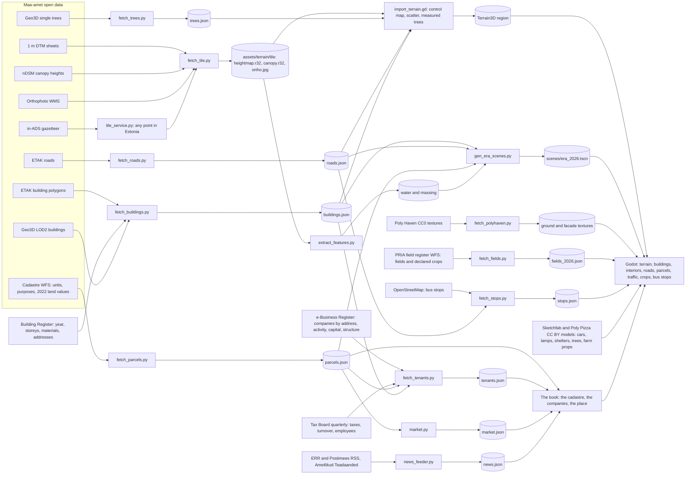

# Vakuraamat

A digital twin of a square kilometre of Estonia, to walk through and ask questions of. The cadastral
plots are the real ones, with their official 2022 taxation values; the buildings are the ones in the
Building Register, with the roofs Maa-amet measured; the companies are the ones registered at each
address; every tree stands where the laser scan found it. Every building has a door and rooms
inside. Built from Maa-amet (Estonian Land and Spatial Development Board), Building Register and
Business Register open data with Godot 4.7, GDScript and Terrain3D.

| | |
|---|---|
|  The front page: the plate of your square kilometre |  The book (Tab): the cadastre with purpose, area, taxation value and ownership |
|  A Kvissentali street: the Building Register's houses on the cadastre's plots |  Inside a company's building: rooms, furniture by use, windows onto the street |
|  The news (N): the region's real headlines and official notices |  The map (M): plots, companies, street names and house numbers on the orthophoto |

## What you do

- **The book (Tab):** the cadastre as a sortable, searchable list - address, purpose, area, the 2022
  taxation value, the form of ownership - and a plot's own page: its land registry number, when it
  was entered in the cadastre, the companies registered there, a link into the register itself, and
  the plot's square out of every orthophoto flown over it since 1993. **B** opens the plot under your
  feet; *Place* is the pack itself, what it holds and where every figure came from.
- **Fly (F):** from the air the crosshair names the building under it, up to six hundred metres out.
- **The news (N):** the region's real headlines and the official notices - planning procedures,
  auctions, bankruptcy proceedings - that name this place's streets, settlements or companies.
- **Walk in:** every real building has a door; inside is generated from its footprint and register
  data (storeys, rooms, stairs, window rhythm) and furnished by use.
- **Know your tenants:** every company carries what the Business Register and the Tax Board publish:
  activity, staff, turnover, taxes, board and owner structure, a health flag. The map (M) colours the
  plots by sector, employees, health, founding year or shared owners; the book has a Companies page;
  shops hang their signs and neon by the door, and billboards advertise the biggest employers.
- **Anywhere in Estonia:** *Locations* in the menu turns an address into a playable square kilometre
  in a couple of minutes, and the neighbouring tiles stream in as you walk.

## Play

Builds for macOS, Windows and Linux are on the [releases page](https://github.com/livenson/vakuraamat/releases)
(GitHub Actions, `.github/workflows/build.yml`): unzip and run; the macOS app is not notarised, so
run `xattr -dr com.apple.quarantine Vakuraamat.app` once or right-click and Open. A build plays the
shipped packs and carries the tile service as a sidecar executable, so *Locations* turns any Estonian
address into a world from the build itself (its packs and downloads live under the game's user
directory).

From the source tree:

```sh
make setup                        # Homebrew tools (godot, blender, uv, git-lfs), the pipeline's Python venv, LFS pull, first Godot import
make tile                         # Maa-amet data for Palupera and its terrain (~10 min, network); SITE=<id> for another pack
make news-local SITE=kvissentali  # optional: today's regional headlines and official notices into the pack
tools/play.sh                     # the tile service plus the game; tools/play.sh -- --site=kvissentali --windowed
```

WASD move, E interact, Tab the book, B this plot, N news, J journal, M map, K codes, F fly,
T teleport, H home, F8 report, Esc menu. `make test` runs the headless suite.

The shipped packs already carry their companies; `make tenants SITE=<id>` refreshes them and, on the
first run, downloads about 460 MB of Business Register and Tax Board open data into `data_raw/`
(cached for a week; worlds created from the menu do the same through the tile service). `make mcp`
builds the Sketchfab MCP server for Claude Code (token in `sketchfab.token`).

## Data sources and how they become a place



The full table of sources, tools, outputs and readers, the make targets and the pipeline internals
are in [docs/data-pipeline.md](docs/data-pipeline.md). Licences and attribution are in
[THIRD_PARTY.md](THIRD_PARTY.md).

## Custom locations

Every place is a site pack under `sites/<id>/`: Kvissentali (Tartu) is the first, Palupera the rural
second. `make site` and `make tile` make one from an EPSG:3301 centre; the tile service does the
same for any point from inside the game, and `make news-local SITE=<id>` fetches what the press and
Ametlikud Teadaanded are saying about it. See [docs/custom-sites.md](docs/custom-sites.md).

## Development

- [docs/dev-loop.md](docs/dev-loop.md): F8 saves a report with a frame and a save; `tools/dev.py`
  replays it, hot reloads scripts, scenes or pack data into the running game, or restarts it at the
  same spot.
- [AGENTS.md](AGENTS.md): conventions, commands and pitfalls for people and coding agents.
- [docs/data-pipeline.md](docs/data-pipeline.md): sources, requirements, make targets, terrain
  pipeline, world mapping, quirks and the repository layout.
- [docs/tv-streaming.md](docs/tv-streaming.md): playing on an Android TV over the home network.
- [docs/historical-imagery.md](docs/historical-imagery.md): a brainstorm — the orthophotos back to
  1993 and the Fotoladu photograph archive, and five ways they could sit in the game. Not built.
- [docs/maaamet-data-reference.md](docs/maaamet-data-reference.md): what Maa-amet publishes and how
  each dataset is converted; [docs/visual-upgrade-plan.md](docs/visual-upgrade-plan.md): rendering steps and their status.
- [docs/history/](docs/history/): the design, plan and language notes of the historical three-era game,
  which lives on at the tag `v0.9-historical`.
- [CHANGELOG.md](CHANGELOG.md): what changed in each release. A release is an annotated `v*` tag;
  pushing it builds the three platforms and attaches them to a GitHub release.

## Licence of the data

Maa-amet open data, free for commercial use with attribution ("Map data: Maa- ja Ruumiamet, 2026",
also in every `terrain_meta.json`); companies from the e-Business Register open data (CC BY 4.0) and
the Tax Board's quarterly figures; bus stops from OpenStreetMap (ODbL); farmed fields from PRIA.
Everything vendored is listed in `THIRD_PARTY.md`.
