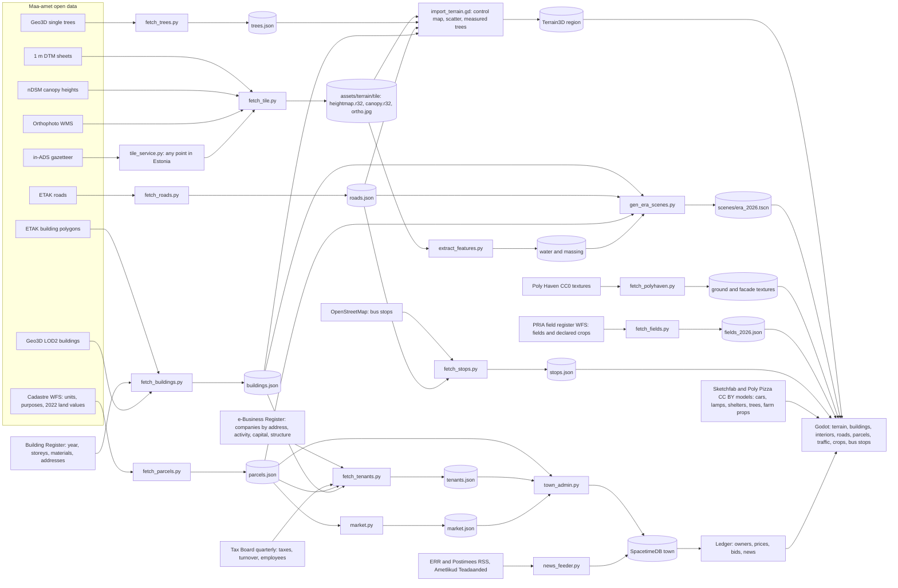

# Vakuraamat

An economy game on real Estonian ground. Buy, rent out and build on the actual cadastral plots of a
square kilometre, priced from the official land values, with the real companies as tenants, alone or
in a town shared with other players. Every building has a door and rooms inside; every tree stands
where the laser scan found it. Built from Maa-amet (Estonian Land and Spatial Development Board) and
Business Register open data with Godot 4.7, GDScript, Terrain3D and SpacetimeDB.

| | |
|---|---|
|  The front page: the menu as a ledger, the plate of your square kilometre |  The book (Tab): plots nearest you with land value, price, owner and yield |
|  A Kvissentali street: real buildings, real tenants on their name plates |  Inside a company's building: rooms, furniture by use, windows onto the street |
|  The town feed (N): the region's real headlines next to the game's events |  The map (M): plots, tenants, street names and house numbers on the orthophoto |

## What you do

- **The book (Tab):** the plots nearest to you with land value, price, owner and monthly yield; a
  plot's card with Buy, Bid, List for sale, Build, Collect or Settle arrears, Accept offer, Guide and
  Go; your portfolio, offers in and out, the town's month and price index. **B** opens the plot under
  your feet.
- **A month every ten real minutes:** rents come in (tenants sometimes fall behind), land tax comes
  due, prices drift, and the Kask, Tamm and Lepik families bid on your plots.
- **Online or offline:** with a town server reachable, everyone in the town shares one ledger and sees
  each other walk; without it the same rules run in your own book.
- **Walk in:** every real building has a door; inside is generated from its footprint and register
  data (storeys, rooms, stairs, window rhythm) and furnished by use.
- **Anywhere in Estonia:** *Locations* in the menu turns an address into a playable square kilometre
  in a couple of minutes, and the neighbouring tiles stream in as you walk.

## Play

```sh
make setup       # Homebrew tools, git-lfs pull, first Godot import
make tile        # Maa-amet data for Palupera and its terrain (~10 min, network); SITE=<id> for another pack
tools/play.sh    # the game with the tile service (or: godot --path .)
```

WASD move, E interact, Tab the book, B buy here, N news, J journal, M map, K codes, F fly,
T teleport, H home, F8 report, Esc menu. `make test` runs the headless suite.

## Data sources and how they become a town



The full table of sources, tools, outputs and readers, the make targets and the pipeline internals
are in [docs/data-pipeline.md](docs/data-pipeline.md). Licences and attribution are in
[THIRD_PARTY.md](THIRD_PARTY.md).

## Custom locations and towns

Every place is a site pack under `sites/<id>/`: Kvissentali (Tartu) is the first town, Palupera the
rural second. `make site` and `make tile` make one from an EPSG:3301 centre; the tile service does
the same for any point from inside the game. A town is a SpacetimeDB database seeded from the pack
(`make server`, `make town SITE=<id>`), and `make news` feeds it the region's real headlines. See
[docs/custom-sites.md](docs/custom-sites.md).

## Development

- [docs/dev-loop.md](docs/dev-loop.md): F8 saves a report with a frame and a save; `tools/dev.py`
  replays it, hot reloads scripts, scenes or pack data into the running game, or restarts it at the
  same spot.
- [AGENTS.md](AGENTS.md): conventions, commands and pitfalls for people and coding agents.
- [docs/data-pipeline.md](docs/data-pipeline.md): sources, requirements, make targets, terrain
  pipeline, world mapping, quirks and the repository layout.
- [docs/tv-streaming.md](docs/tv-streaming.md): playing on an Android TV over the home network.
- [docs/maaamet-data-reference.md](docs/maaamet-data-reference.md): what Maa-amet publishes and how
  each dataset is converted; [docs/visual-upgrade-plan.md](docs/visual-upgrade-plan.md): rendering steps and their status.
- [docs/history/](docs/history/): the design, plan and language notes of the historical three-era game,
  which lives on at the tag `v0.9-historical`.

## Licence of the data

Maa-amet open data, free for commercial use with attribution ("Map data: Maa- ja Ruumiamet, 2026",
also in every `terrain_meta.json`); companies from the e-Business Register open data (CC BY 4.0).
Everything vendored is listed in `THIRD_PARTY.md`.
