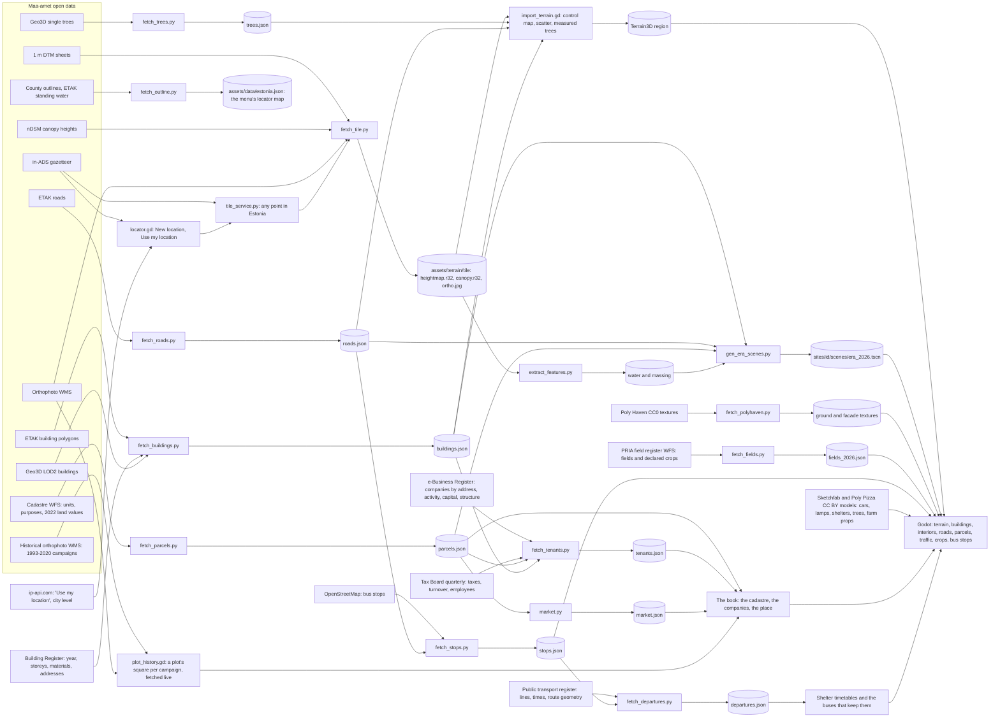

# Vakuraamat

[](https://github.com/livenson/vakuraamat/releases/latest)
[](https://github.com/livenson/vakuraamat/releases/latest)

A digital twin of a square kilometre of Estonia, to walk through and ask questions of. The cadastral
plots are the real ones, with their official 2022 taxation values; the buildings are the ones in the
Building Register, with the roofs Maa-amet measured; the companies are the ones registered at each
address; every tree stands where the laser scan found it. Every building has a door and rooms
inside. Built from Maa-amet (Estonian Land and Spatial Development Board), Building Register and
Business Register open data with Godot 4.7, GDScript and Terrain3D.

**[⬇ Download the latest release](https://github.com/livenson/vakuraamat/releases/latest)** — a
ready-to-play build for macOS, Windows or Linux. No Godot, no Python, nothing else to install.

| | |
|---|---|
|  The front page: the plate of your square kilometre |  The book (Tab): the cadastre with purpose, area, taxation value and ownership |
|  A Kvissentali street: the Building Register's houses on the cadastre's plots |  Inside a company's building: rooms, stairs and windows onto the real street |
|  The map (M): plots, companies, street names and house numbers on the orthophoto |  A plot over the years: every orthophoto flown over it since 1993 |

## Install and play

1. Open the **[latest release](https://github.com/livenson/vakuraamat/releases/latest)** and download
   the zip for your platform (about 420–450 MB — the packs carry their terrain, models and textures):

   | Platform | File | Run |
   |---|---|---|
   | macOS (Apple silicon and Intel) | `Vakuraamat-<version>-macos.zip` | `Vakuraamat.app` |
   | Windows | `Vakuraamat-<version>-windows.zip` | `Vakuraamat.exe` |
   | Linux (x86-64) | `Vakuraamat-<version>-linux.zip` | `./Vakuraamat.x86_64` |

2. Unzip it, keeping the files together — the executable, its `.pck` and the `tile_service` sidecar
   next to it are one build.
3. Run it. On **macOS** the app is not notarised, so the first launch needs one of:

   ```sh
   xattr -dr com.apple.quarantine Vakuraamat.app     # or: right-click the app and choose Open
   ```

   On **Linux**, mark it executable if the unzip did not: `chmod +x Vakuraamat.x86_64`.
4. Pick a place on the front page. Two worlds ship with the build — **Kvissentali** (a Tartu suburb)
   and **Palupera** (rural) — and *Locations* turns any Estonian address into a new square kilometre
   in a couple of minutes over the network, because the build carries the whole data pipeline as a
   sidecar executable. Worlds you make and the data they download live under the game's user
   directory, not in the app.

Nothing else is needed to play: no Godot, no Python, no account, no data download beyond the zip.
What changed in each build is in [CHANGELOG.md](CHANGELOG.md).

### Controls

WASD move, E interact, Tab the book, B this plot, J journal, M map, I layer, K codes, F fly,
T teleport, H home, F8 report, Esc menu.

## What you do

- **The book (Tab):** the cadastre as a sortable, searchable list - address, purpose, area, the 2022
  taxation value, the form of ownership - and a plot's own page: its land registry number, when it
  was entered in the cadastre, the companies registered there, a link into the register itself, and
  the plot's square from each national orthophoto campaign since 1993 (1993-2000, 2005, 2010, 2015,
  2020) and from today's. **B** opens the plot under your
  feet; *Place* is the pack itself, what it holds and where every figure came from.
- **Fly (F):** from the air the crosshair names the building under it, up to six hundred metres out.
- **The buses are the real ones:** the shelter's board carries the timetable the public transport
  register publishes for that stop, and a bus turns up to run it. Kvissentali is the end of lines 8
  and 10; Palupera gets one a day to Elva, Otepää, Puka and Valga.
- **Walk in:** every real building has a door; inside is generated from its footprint and register
  data (storeys, rooms, stairs, window rhythm), and the windows look out at the real street.
- **Know your tenants:** every company carries what the Business Register and the Tax Board publish:
  activity, staff, turnover, taxes, board and owner structure, a health flag. The map (M) colours the
  plots by sector, employees, health, founding year or shared owners; the book has a Companies page;
  shops hang their signs and neon by the door, and billboards advertise the biggest employers.
- **Anywhere in Estonia:** *Locations* in the menu turns an address into a playable square kilometre
  in a couple of minutes, and the neighbouring tiles stream in as you walk.

## Run from source

For developing on the game, or for making packs outside the game. Tested on macOS; `make setup`
installs its tools with Homebrew, and on Linux the same four (Godot 4.7.2, Blender, uv, git-lfs)
work if installed by hand.

```sh
git clone https://github.com/livenson/vakuraamat.git && cd vakuraamat
make setup                        # Homebrew tools (godot, blender, uv, git-lfs), the pipeline's Python venv, LFS pull, first Godot import
make tile                         # Maa-amet data for Palupera and its terrain (~10 min, network); SITE=<id> for another pack
tools/play.sh                     # the tile service plus the game; tools/play.sh -- --site=kvissentali --windowed
```

`make test` runs the headless suite; `make validate` checks the packs.

The shipped packs already carry their companies; `make tenants SITE=<id>` refreshes them and, on the
first run, downloads about 460 MB of Business Register and Tax Board open data into `data_raw/`
(cached for a week; worlds created from the menu do the same through the tile service). `make mcp`
builds the Sketchfab MCP server for Claude Code (token in `sketchfab.token`).

Releases are built by GitHub Actions (`.github/workflows/build.yml`): pushing an annotated `v*` tag
exports the three platforms, bundles the tile-service sidecar with each, and attaches them to a
GitHub release whose notes are this tag's `CHANGELOG.md` entry.

## Data sources and how they become a place



The full table of sources, tools, outputs and readers, the make targets and the pipeline internals
are in [docs/data-pipeline.md](docs/data-pipeline.md). Licences and attribution are in
[THIRD_PARTY.md](THIRD_PARTY.md).

## Custom locations

Every place is a site pack under `sites/<id>/`: Kvissentali (Tartu) is the first, Palupera the rural
second. `make site` and `make tile` make one from an EPSG:3301 centre; the tile service does the
same for any point from inside the game. See [docs/custom-sites.md](docs/custom-sites.md).

## Development

- [docs/dev-loop.md](docs/dev-loop.md): F8 saves a report with a frame and a save; `tools/dev.py`
  replays it, hot reloads scripts, scenes or pack data into the running game, or restarts it at the
  same spot.
- [AGENTS.md](AGENTS.md): conventions, commands and pitfalls for people and coding agents.
- [docs/data-pipeline.md](docs/data-pipeline.md): sources, requirements, make targets, terrain
  pipeline, world mapping, quirks and the repository layout.
- [docs/tv-streaming.md](docs/tv-streaming.md): playing on an Android TV over the home network.
- [docs/historical-imagery.md](docs/historical-imagery.md): the orthophotos back to 1993 and the
  Fotoladu photograph archive, and five ways they could sit in the game; the plot page's pictures
  over the years (option 4) are built, the rest is a brainstorm.
- [docs/maaamet-data-reference.md](docs/maaamet-data-reference.md): what Maa-amet publishes and how
  each dataset is converted; [docs/visual-upgrade-plan.md](docs/visual-upgrade-plan.md): rendering steps and their status.
- [docs/history/](docs/history/): the design, plan and language notes of the historical three-era game,
  which lives on at the tag `v0.9-historical`.
- [CHANGELOG.md](CHANGELOG.md): what changed in each release (see *Run from source* above for how
  a `v*` tag becomes the three builds).

## Licence of the data

Maa-amet open data - the ground, the orthophotos, the cadastre, ETAK, the Geo3D roofs and trees -
free for commercial use with attribution ("Map data: Maa- ja Ruumiamet (Estonian Land and Spatial
Development Board), 2026", also in every `terrain_meta.json`); buildings' attributes from the
Building Register (EHR); companies from the e-Business Register open data (CC BY 4.0) and the Tax
Board's quarterly figures; bus stops from OpenStreetMap (ODbL: `stops.json` stays under it); lines
and times from the public transport register's open data; farmed fields from PRIA. The optional "Use
my location" asks ip-api.com for a city-level point (free for non-commercial use). Every pack file
carries its own `attribution`, and the book's *Place* page prints them. Everything vendored is listed
in `THIRD_PARTY.md`.
